# Application workflow

This diagram separates the application checks from the database checks:

- NestJS verifies the JWT and checks current membership, role, and operation-specific state.
- PostgreSQL forced RLS independently enforces tenant visibility and invoice ownership.
- The refund SQL function repeats its critical authorization and validation inside one transaction.

```mermaid
sequenceDiagram
    autonumber

    actor User
    participant Web as Next.js Web App
    participant Auth as Supabase Auth
    participant API as NestJS API Edge
    participant Guard as AuthGuard
    participant JWT as JwtVerifier
    participant JWKS as Supabase JWKS
    participant Service as Domain Service
    participant Membership as MembershipService
    participant REST as Supabase PostgREST
    participant DB as PostgreSQL + Forced RLS
    participant Audit as Private Audit Writer

    User->>Web: Enter email and password
    Web->>Auth: signInWithPassword()
    Auth->>Auth: Validate credentials and sign JWT
    Auth-->>Web: ES256 access JWT and session
    Web-->>User: Show authenticated dashboard

    User->>Web: Perform a domain action
    Web->>API: HTTP request with Bearer JWT

    API->>API: Assign X-Request-Id
    API->>API: Apply Helmet headers
    API->>API: Parse size-limited body
    API->>API: Enforce JSON-depth and rate limits
    API->>API: Validate DTO and reject unknown fields

    API->>Guard: Run AuthGuard
    Guard->>Guard: Extract Bearer token
    Guard->>JWT: verify(token)

    opt Matching public key is not cached
        JWT->>JWKS: GET /auth/v1/.well-known/jwks.json
        JWKS-->>JWT: Public signing keys
        JWT->>JWT: Select key matching JWT kid
    end

    JWT->>JWT: Verify signature, issuer, audience, exp, iat, and sub

    alt JWT is invalid
        JWT-->>Guard: UnauthenticatedError
        Guard->>Audit: Record rejected authentication
        Audit->>DB: Insert audit event with isolated service role
        API-->>Web: 401 Problem Details
        Web-->>User: Show authentication error
    else JWT is valid
        JWT-->>Guard: Verified userId from sub
        Guard->>Guard: Attach principal and original token
        Guard-->>API: Continue to controller
        API->>Service: Call route-specific service

        Service->>Membership: loadActiveMembership(userId, organizationId)
        Membership->>REST: Query membership using caller JWT
        REST->>DB: Execute as authenticated caller
        DB->>DB: Derive auth.uid() and apply forced RLS
        DB-->>Membership: Visible membership or no row

        alt Membership is absent or hidden
            Membership-->>API: 404 not_found
            API->>Audit: Record rejected request
            Audit->>DB: Insert rejected audit event
            API-->>Web: 404 Problem Details
            Web-->>User: Resource not found
        else Membership is suspended
            Membership-->>API: 403 forbidden
            API->>Audit: Record rejected request
            Audit->>DB: Insert rejected audit event
            API-->>Web: 403 Problem Details
            Web-->>User: Permission denied
        else Membership is active
            Membership-->>Service: Current database role
            Service->>Service: Check endpoint role

            alt Role is insufficient
                Service-->>API: 403 forbidden
                API->>Audit: Record rejected operation
                Audit->>DB: Insert rejected audit event
                API-->>Web: 403 Problem Details
                Web-->>User: Permission denied
            else Role is sufficient
                Service->>REST: Query target by organization and target ID
                REST->>DB: Execute using the same caller JWT
                DB->>DB: Enforce tenant and ownership through forced RLS
                DB-->>Service: Visible target or no row

                alt Target is missing or hidden by RLS
                    Service-->>API: 404 not_found
                    API->>Audit: Record rejected operation
                    Audit->>DB: Insert rejected audit event
                    API-->>Web: 404 Problem Details
                    Web-->>User: Resource not found
                else Target is visible
                    alt Request creates a refund
                        Service->>REST: rpc(create_refund)
                        REST->>DB: Execute with caller JWT
                        DB->>DB: Read actor from auth.uid()
                        DB->>DB: Lock invoice row
                        DB->>DB: Derive tenant from locked invoice
                        DB->>DB: Recheck active manager/admin role
                        DB->>DB: Check idempotency before mutable state
                        DB->>DB: Validate state, amount, currency, and cumulative cap

                        alt Same key and same payload
                            DB-->>Service: Return original refund
                            Service-->>API: Existing refund
                            API-->>Web: 200 idempotent replay
                            Web-->>User: Show original refund
                        else Same key with different payload
                            DB-->>Service: idempotency_conflict
                            Service->>Audit: Record rejected conflict
                            Audit->>DB: Insert rejected audit event
                            Service-->>API: 409 idempotency_conflict
                            API-->>Web: 409 Problem Details
                            Web-->>User: Show conflict
                        else New valid refund
                            DB->>DB: Insert refund and success audit atomically
                            DB->>DB: Commit transaction
                            DB-->>Service: New refund
                            Service-->>API: Successful refund
                            API-->>Web: 201 refund result
                            Web-->>User: Show completed refund
                        end
                    else Other domain request
                        Service->>Service: Validate operation-specific state

                        alt State is invalid
                            Service->>Audit: Record rejected operation
                            Audit->>DB: Insert rejected audit event
                            Service-->>API: 409 invalid_state
                            API-->>Web: 409 Problem Details
                            Web-->>User: Show conflict
                        else State is valid
                            Service->>REST: Create or update domain row
                            REST->>DB: Execute with caller JWT
                            DB->>DB: Reapply RLS, constraints, and triggers
                            DB-->>Service: Domain result
                            Service-->>API: Successful result
                            API-->>Web: 2xx JSON with X-Request-Id
                            Web-->>User: Render updated page
                        end
                    end
                end
            end
        end
    end
```

