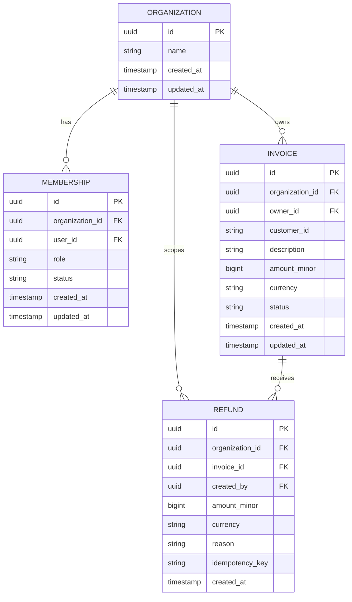
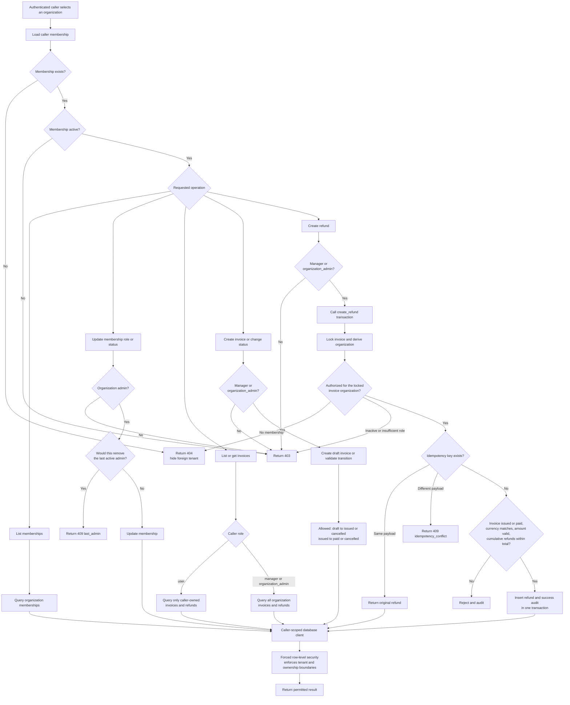

# Organization, Membership, Invoice, and Refund Model

This document isolates the four core domain resources. User/profile records are external references and are intentionally omitted from the diagrams.

## Entity relationships

Key constraints:

- One membership is allowed per `(organization_id, user_id)`.
- One refund idempotency key is allowed per `(invoice_id, idempotency_key)`.
- Membership roles are `user`, `manager`, or `organization_admin`; status is `active` or `suspended`.
- Invoice status is `draft`, `issued`, `paid`, or `cancelled`.
- Every invoice and refund belongs to exactly one organization. A refund also belongs to exactly one invoice.

## Domain workflow

The application checks membership, status, and endpoint roles before domain work. PostgreSQL row-level security independently enforces organization and ownership boundaries. Refund creation adds a second database-side authorization check inside its transaction.
